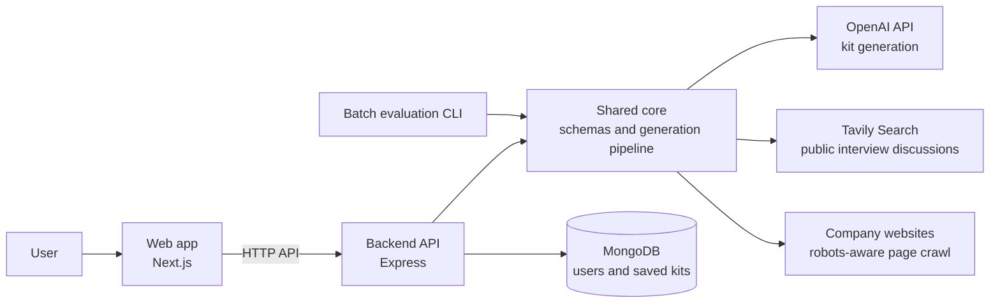

# PrepStudio — AI Interview Prep Kit

PrepStudio turns a job description, company website, and time until an interview into an editable interview-preparation kit. It researches the employer, extracts role requirements, creates questions and answer guides, checks requirement coverage, and schedules practice.

## Technology and architecture

- **Web:** Next.js App Router, React, TypeScript, Tailwind CSS, and Framer Motion.
- **API:** Node.js, Express, and TypeScript.
- **Storage and authentication:** MongoDB with Mongoose, bcrypt password hashing, and signed JWT cookies.
- **Generation:** OpenAI Chat Completions API (`gpt-4o-mini` by default).
- **Search:** bounded company-site HTML crawling and Tavily Search for public interview discussions.
- **Validation:** Zod schemas shared by the API, core package, and CLI.

The repository is an npm-workspaces monorepo. `packages/core` owns the kit schema and generation pipeline, and is imported by both `packages/server` and `packages/cli`. This keeps web and batch generation on the same implementation. The core package is a shared library; it is not a separately deployed service.

### High-level architecture



The web app handles the user experience, while the API authenticates users and stores their kits. The API and batch CLI both call the shared core, which validates data, researches sources, generates content, checks requirement coverage, and builds the study schedule.

## Local setup

Use Node.js 20 or newer. From the repository root:

```sh
npm ci
```

Copy `.env.example` to `.env` in the repository root, then configure the values below. For the web app, run a local MongoDB instance or provide a MongoDB connection string. OpenAI credentials are required to generate content. Tavily enables public interview-discussion search; without it the pipeline records that no discussion results were available.

| Variable | Used by | Purpose |
| --- | --- | --- |
| `OPENAI_API_KEY` | API and CLI | Secret key used to generate and structure kit content. |
| `OPENAI_MODEL` | API and CLI | OpenAI model name; defaults to `gpt-4o-mini`. |
| `TAVILY_API_KEY` | API and CLI | Enables public-web search for interview-process discussions. If unset, this research step is skipped and reported honestly. |
| `MONGODB_URI` | API | MongoDB connection string for users and saved kits. Not needed by the CLI. |
| `JWT_SECRET` | API | Secret used to sign authentication cookies. Use a long, random value. Not needed by the CLI. |
| `PORT` | API | HTTP port; defaults to `4000`. |
| `WEB_ORIGIN` | API | Exact allowed frontend origin for CORS, for example `http://localhost:3000`; do not add a trailing slash. |
| `NEXT_PUBLIC_API_URL` | Web | API base URL including `/api`, for example `http://localhost:4000/api`. |
| `ALLOW_LOCAL_FETCH` | CLI | Set to `true` only to test the CLI against a localhost fixture. Keep `false` for normal use; the web API always blocks local fetches. |

Run the API and web application in separate terminals from the repository root:

```sh
npm run dev:server
npm run dev
```

Open `http://localhost:3000`. The API base is `http://localhost:4000/api`; its health endpoint is `http://localhost:4000/api/health`.

## Batch evaluation CLI

The assessment command accepts a JSON array of cases and writes a JSON result file:

```sh
npm run evaluate -- --input cases.json --output kits.json
```

Put `cases.json` in the repository root, or pass paths relative to the directory where you run the command. Each input item has this shape:

```json
[
  {
    "id": "case-1",
    "jd": "Paste the complete job description here",
    "company_url": "https://example.com/careers",
    "days": 5
  }
]
```

The output is a JSON object with `version`, `generated_at`, and a `kits` array. Each item is either `{ "id", "status": "ok", "kit", "error": null }` or `{ "id", "status": "failed", "kit": null, "error": { "code", "message" } }`. Successful `kit` objects contain exactly the Appendix A fields; internal edit metadata is omitted. The CLI continues to the next case if a case fails. It uses OpenAI and, when configured, Tavily; it does not need MongoDB or `JWT_SECRET`.

## Generation pipeline and coverage

The pipeline runs in stages and reports progress:

1. Extract the role, responsibilities, and requirements from the supplied job description. Explicit required qualifications are marked `must`; preferred or bonus items are `nice`.
2. Check `robots.txt` and crawl relevant same-host pages using breadth-first traversal, depth two, at most 15 pages, and a 2 MB per-page limit. Failed pages are skipped.
3. Search Tavily for independent public interview discussions, excluding the employer's own domain. Up to three result URLs and snippets are used as evidence. Without a key or relevant results, the kit says public discussion was not found instead of inventing it.
4. Generate a company brief from retrieved evidence and generate questions for role requirements.
5. Allocate questions across the requested number of days using deterministic code.
6. Check question-to-requirement coverage in code. If anything is uncovered, generate a gap-only second pass and check again. If any `must` requirement remains uncovered after that pass, the case fails with an error and no incomplete kit is returned. Remaining `nice` gaps are retained and reported in the kit.
7. Validate the kit against the schema before saving or writing it.

OpenAI calls retry transient errors and HTTP 429 responses up to five times with exponential delay and jitter, respecting `Retry-After`. Company-page requests retry up to three times. A repeated JD/company URL is deduplicated by `inputHash`; an active request is reused and a failed request can be retried.

## Schedule and practice

Questions are prioritized by requirement priority, difficulty, and stable ID. Difficulty maps to estimated effort of 10, 15, or 25 minutes. Questions go to the least-loaded day with a slight early-day weighting. The schedule has exactly the requested number of days; unused days become review days. A one-day schedule includes all questions.

Practice mode shows flashcards one at a time, records confidence from 1 to 5, and prioritizes review with `(must ? 2 : 1) × difficulty × (6 − confidence)`. The **Weak spots** report groups rated cards by linked requirement and explains the score; unrated cards do not appear. **Interview Day Game Plan** gives a short role recap, key role priorities, questions to ask, and a ready-to-go checklist. Its checklist progress is stored in the current browser per kit.

## Editing and regeneration

Requirements, questions, flashcards, the company brief, and schedule days carry metadata indicating whether content was generated, edited, or user-created, whether it is pinned, and its version. Editing pins the item and increments its version; user-created questions and cards start pinned. Reordering or moving a question keeps its metadata. Deleting an item also removes its schedule references. Dedicated actions regenerate the brief, a question category, or the schedule; pinned content is preserved, and question regeneration rechecks coverage. The browser updates optimistically and restores the prior state if saving fails.

## Security and failure handling

Passwords are bcrypt-hashed. Authentication uses an httpOnly signed JWT cookie, and production requires `JWT_SECRET` and secure cookies. Kit queries are scoped to the authenticated owner. Incoming changes are Zod-validated, authentication and generation routes are rate-limited, and CORS is restricted to `WEB_ORIGIN`. External fetches require HTTP(S), reject private and loopback IPs after DNS resolution, recheck redirects, accept HTML only, and cap response size. Retrieved pages and job descriptions are treated as untrusted data in generation prompts.

A failed company-page fetch is skipped rather than failing the whole pipeline. A short job description may produce a limited kit. Lack of public discussion results is disclosed. A case is marked failed if generation fails or the required `must` coverage check still fails after the second pass.

## Build and checks

```sh
npm run typecheck
npm test
npm run build
```

Core tests cover requirement priority and coverage, Appendix A structure and references, and schedule edge cases such as one day and more days than questions.

## Deployment

Deploy the frontend and API as separate services from this monorepo. Deploy `packages/core` as part of each service's build; it is not a standalone service. Keep all secret values in the hosting providers' environment-variable settings, never in frontend code or committed files.

### API on Render

- Create a Web Service from the repository and leave **Root Directory** blank so Render checks out the repository root and can access all npm workspaces.
- Build command:

  ```sh
  npm ci && npm run build --workspace @interview-prep/core && npm run build --workspace @interview-prep/server
  ```

- Start command:

  ```sh
  node packages/server/dist/index.js
  ```

- Set `OPENAI_API_KEY`, `OPENAI_MODEL`, `TAVILY_API_KEY`, `MONGODB_URI`, `JWT_SECRET`, and `WEB_ORIGIN`. Render supplies `PORT`. `WEB_ORIGIN` must exactly match the deployed frontend origin, without a trailing slash. Keep `ALLOW_LOCAL_FETCH=false`.

### Web app on Vercel

- Import the same repository as a Vercel project and set **Root Directory** to `packages/web`.
- Enable **Include source files outside of the Root Directory in the Build Step** so the web build can use the shared `packages/core` workspace.
- Build command: `npm run build`. The web workspace's `prebuild` script builds `packages/core` first.
- Set `NEXT_PUBLIC_API_URL` to the Render API URL ending in `/api`, for example `https://your-api.onrender.com/api`. This value is embedded at build time, so redeploy the frontend after changing it.

The deployed web origin must also be set as `WEB_ORIGIN` on Render. Confirm the API health endpoint responds at `https://your-api.onrender.com/api/health`, then try account registration and sign-in from the deployed frontend.

## Known limitations

- The crawler processes static HTML and does not run client-side JavaScript.
- Public interview-discussion search requires a Tavily API key. Without one, the pipeline marks that research as unavailable; it does not claim to have searched.
- Crawling and retries are bounded. If the server restarts during generation, the case is replayed from the beginning.
- The web interface's batch upload accepts CSV with the header `id,jd,company_url,days`; the assessment CLI uses the JSON contract described above.
